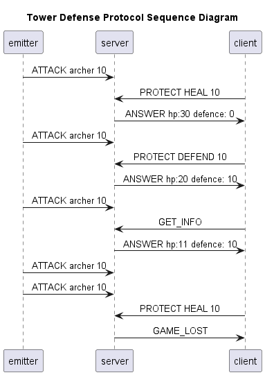
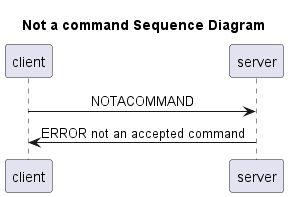
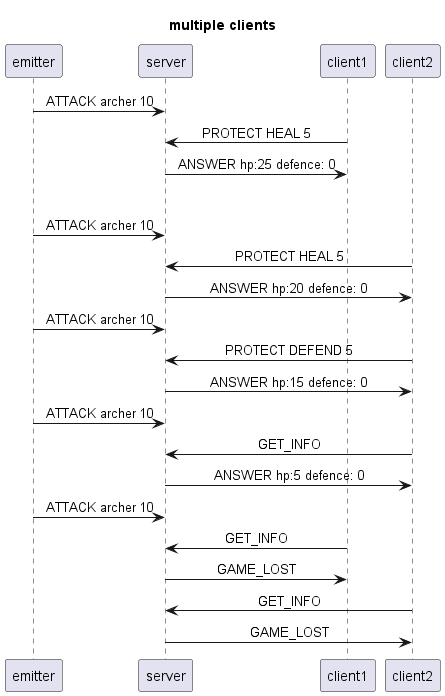

# DAI-PW3 Tower Defense

## Introduction

This is an application that simulates a tower defense game. Where enemies are multicasting attacks and
a server is listening to the attacks. The server is also listening to unicast messages from the client and 
is responding to them. 

## How to build the application

### With Docker

No need to build the docker image as it is [saved](https://github.com/BetterBlood/DAI-PW3/pkgs/container/tower-defense) 
on the GitHub Container Registry.

If you have done some modifications on the code, build the docker image run the following command:

```
docker build -t ghcr.io/betterblood/tower-defense:latest .
```

### Without Docker 

You can build the application using the pre-made build configuration in intellij.

## How to run the application

### With Docker

In order to run the server and emitters run the following command:

```
docker compose up tower warrior archer
```

And to start a new client run the following command (you can run multiple clients):

```
docker compose run ally
```

### Without Docker

To run the clients (allies):
```
java -jar .\target\dai-pw3-1.0-SNAPSHOT.jar client
```

To run the server (tower)
```
 java -jar .\target\dai-pw3-1.0-SNAPSHOT.jar server -i eth0 --hostm 239.1.1.1
```

To run the emitters (ennemies)
```
 java -jar .\target\dai-pw3-1.0-SNAPSHOT.jar enemy -i eth0 --host 239.1.1.1
```


Those are running the with the default parameters, if you want custom ports and host you can specify them, as pictures in this help command from 

- Base help
```
Usage: dai-pw3-1.0-SNAPSHOT.jar [-hV] [COMMAND]
Tower Defense, third Practical Work of DAI
  -h, --help      Show this help message and exit.
  -V, --version   Print version information and exit.
Commands:
  client  Starts a client for a game of Tower Defense
  enemy   Start an UDP multicast emitter representing an enemy
  server  Starts a server for a game of Tower Defense

```
- Server help

```
Usage: dai-pw3-1.0-SNAPSHOT.jar server [-hV] [-bh=<baseHP>]
                                       [-bp=<baseProtection>] -hm=<hostm>
                                       -i=<interfaceName> [-pm=<portm>]
                                       [-pu=<portu>]
Starts a server for a game of Tower Defense
      -bh, --baseHP=<baseHP> Base hp for the tower.
      -bp, --baseProtection=<baseProtection>
                             Base protection for the tower, between 0-100.
  -h, --help                 Show this help message and exit.
      -hm, --hostm=<hostm>   Subnet range/multicast address to use.
  -i, --interface=<interfaceName>
                             Interface to use
      -pm, --portm=<portm>   Port to use for the mulitcast connection
                               (ennemies) (default: 9876).
      -pu, --portu=<portu>   Port to use for the unicast connections (allies)
                               (default: 1234).
  -V, --version              Print version information and exit.

```

- Client help

```
Usage: dai-pw3-1.0-SNAPSHOT.jar client [-h=<host>] [-p=<port>]
Starts a client for a game of Tower Defense
  -h, --host=<host>   Host for the unicast connection
  -p, --port=<port>   Port to use for the mulitcast connection (default: 1234).

```

- Emitter help

```
Usage: dai-pw3-1.0-SNAPSHOT.jar enemy [-d=<damage>] -h=<host>
                                      -i=<interfaceName> [-n=<name>]
                                      [-p=<port>] [-pa=<pause>]
Start an UDP multicast emitter representing an enemy
  -d, --damage=<damage>      Damage sent to tower (default: 10).
  -h, --host=<host>          Subnet range/multicast address to use.
  -i, --interface=<interfaceName>
                             Interface to use.
  -n, --name=<name>          Name of the enemy.
  -p, --port=<port>          Port to use for the mulitcast connection (default:
                               9876).
      -pa, --pause=<pause>   Pause between attacks (in milliseconds) (default:
                               10000).

```


## How to use the application

### Server and emitters
```text
docker compose up tower warrior archer

[+] Running 3/3
 ✔ Container dai-pw3-towerdefense-tower-1    Recreated                                                                   0.2s 
 ✔ Container dai-pw3-towerdefense-warrior-1  Recreated                                                                   0.1s 
 ✔ Container dai-pw3-towerdefense-archer-1   Recreated                                                                   0.2s 
Attaching to dai-pw3-towerdefense-archer-1, dai-pw3-towerdefense-tower-1, dai-pw3-towerdefense-warrior-1
dai-pw3-towerdefense-tower-1    | Multicast receiver started (172.21.0.2:9876)
dai-pw3-towerdefense-tower-1    | Unicast receiver started (172.21.0.2:1234)
dai-pw3-towerdefense-archer-1   | archer2 as multicast emitter started (172.21.0.3:9876)
dai-pw3-towerdefense-warrior-1  | archer1 as multicast emitter started (172.21.0.4:9876)
dai-pw3-towerdefense-archer-1   | Multicasting 'ATTACK archer2 250' to 239.1.1.1:9876 on interface eth0
dai-pw3-towerdefense-tower-1    | Multicast receiver (172.21.0.2:9876) received message: ATTACK archer2 250
...
dai-pw3-towerdefense-warrior-1  | Multicasting 'ATTACK archer1 500' to 239.1.1.1:9876 on interface eth0
dai-pw3-towerdefense-tower-1    | Multicast receiver (172.21.0.2:9876) received message: ATTACK archer1 500
...
dai-pw3-towerdefense-tower-1    | Unicast receiver (172.21.0.2:1234) received message: GET_INFO
dai-pw3-towerdefense-tower-1    | Unicast receiver (172.21.0.2:1234) received message: GET_INFO
...
dai-pw3-towerdefense-tower-1    | Unicast receiver (172.21.0.2:1234) received message: GET_INFO
...
```

### Client

```
docker compose run ally
Client emitter started (172.21.0.5:1234)
listen client console input [h for help] : get
Unicasting 'GET_INFO' to tower:1234 at 2023-12-19 10:21:20
sending... data sent !
[TOWER INFO] : TowerDefense{hp=9500, protection=0}
listen client console input [h for help] : get
Unicasting 'GET_INFO' to tower:1234 at 2023-12-19 10:22:01
sending... data sent !
[TOWER INFO] : TowerDefense{hp=4000, protection=0}
listen client console input [h for help] : get
Unicasting 'GET_INFO' to tower:1234 at 2023-12-19 10:22:04
sending... data sent !
[TOWER INFO] : TowerDefense{hp=3500, protection=0}
listen client console input [h for help] : get
Unicasting 'GET_INFO' to tower:1234 at 2023-12-19 10:22:40
sending... data sent !
[TOWER INFO] : GAME OVER X_X (press enter to leave)
```
## Protocol

### Section 1 - Overview

The tower defense protocol defines a tower defense game where enemies (emitters) attack a tower (server) which can be 
defended by several allies (clients). The clients can either heal or defend which will respectively add HP to the tower
or make the enemies attacks less effective by adding some defense. The enemies can have different attacks strength and 
cooldown between attacks. The game is finished when the tower is destroyed, you cannot win, but you can try to hold as 
long as possible.

### Section 2 - Transport protocol

The tower defense protocol uses the UDP protocol for each connection. The enemies are using multicast connections 
(fire and forget) to send information to the server. The clients (allies) are communicating with the server (tower) with an 
unicast connection (request / response).

The clients send its requests on the address `localhost` and port `1234`

The server listens for clients on address: `localhost` and port `1234` and 
for enemies on the multicast address `239.1.1.1` and port `9876`

### Section 3 - Messages

#### emitters - MULTICAST communication with server (tower):

- `ATTACK <type> <dmg>`: used to attack the tower
  - `<type>` : name of enemy
  - `<dmg>`  : amount of dmg made to the tower

#### client - UNICAST communication with server (tower):

- `PROTECT <type> <amount>`: used to protect the tower
  - `<type>` : either HEAL of DEFEND 
  - `<amount>` nbr of hp to add to the tower or amount of defense to add to the tower

- `GET_INFO` : asks the server for its related information

#### server - UNICAST communication with client (ally):

- `ANSWER <info>`: send the information concerning its state to the client, triggered by PROTECT and GET_INFO
  - `<info>` amount of hp/hp max, amount of defense/defense max

- `GAME_LOST` : sent when the tower is destroyed

- `ERROR`: the message sent by the client cannot be processed by the server


### Section 4 - Examples





